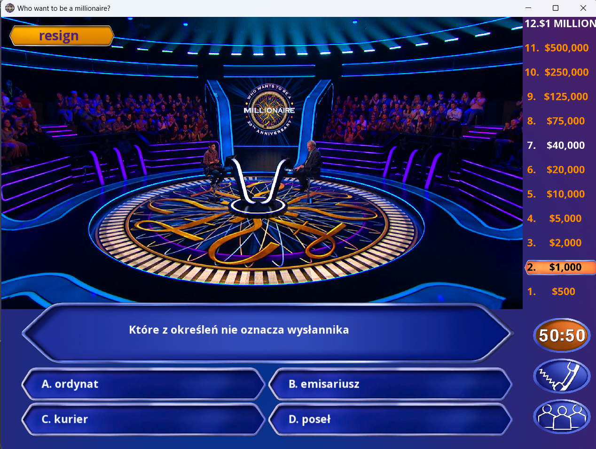
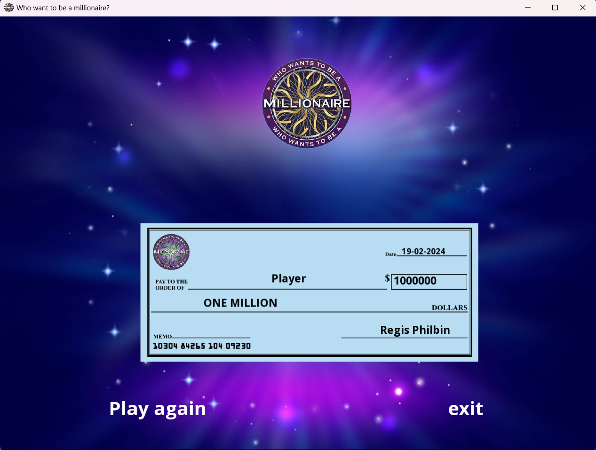

# Who Wants to Be a Millionaire?

## Description

A classic game inspired by the cult TV show 'Who wants to be a millionaire'. The game features a full soundtrack, question pool and lifelines. There is an option for AI to generate new questions in real time.


## Technologies

- C++
- SFML
- Open AI C++
- Google Test
- CMake

## Setup

To run this project, type in terminal:

```
cd Who-Wants-to-Be-a-Millionaire/
mkdir build
cd build/
cmake ../
make
./Who-Wants-to-Be-a-Millionaire
```

## Preview

[YouTube preview](https://www.youtube.com/watch?v=f5JcORlu0jo&list=PLcTxPGo7EwPSk2s6yrAJNdqyRG1AVIreJ&index=2)


